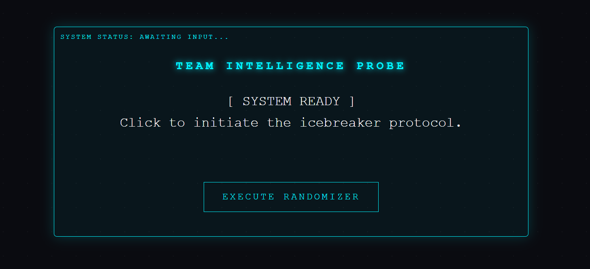

# 🤖 Cyber-Pulse Icebreaker

A sleek, futuristic web-based icebreaker tool designed for **Chairing Meetings** with a tech-savvy flair. Perfect for developers, AI enthusiasts, and Business Analysts (BAs) who are tired of generic random question generators.

## 🚀 Why This Project?
Traditional icebreakers can feel "buggy" or outdated. This tool was built to:
- ⚡ **Replace** generic web generators with a custom-coded experience.
- 🎨 **Entice** teams with a "Cyberpunk/Hacker" UI.
- 📊 **Bridge the Gap** between Coder-speak and Business Analysis.

## 🛠️ Tech Stack
- **HTML5** - Semantic structure.
- **CSS3** - Neon aesthetics, glitch hover effects, and scanning animations.
- **JavaScript** - Randomization logic and "Typewriter" simulation.

## 🕹️ Features
- **[ SYSTEM READY ]** Initial state for clean screen sharing.
- **Scanning Animation**: A visual pulse that "analyzes team metadata" before revealing a question.
- **BA-Focused Logic**: Questions are tailored to the world of Requirements, AI, and Automation.

## 📖 How to Run
1. Clone the repository.
2. Open `index.html` in any modern browser.
3. Share your screen during your meeting and hit **Execute Randomizer**.

## 🧠 Sample Prompts
- 🤖 *If we replaced our project sponsor with an AI, what would be its first 'Bug Fix'?*
- 📈 *What is a 'Non-Functional Requirement' for your happiness this week?*
- 🕹️ *If you were a software update, what 'New Feature' would you bring to the team?*

---
*Built with 💙 by a Coder for the Team.*